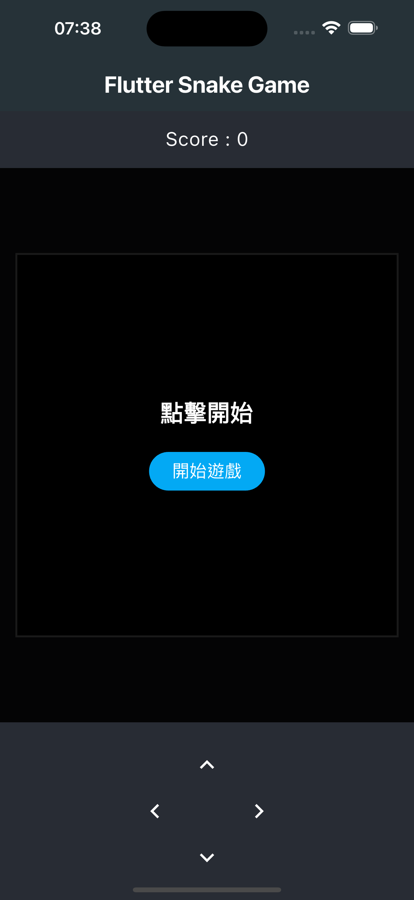
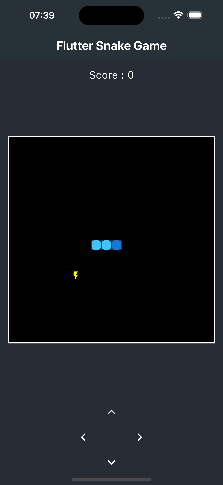
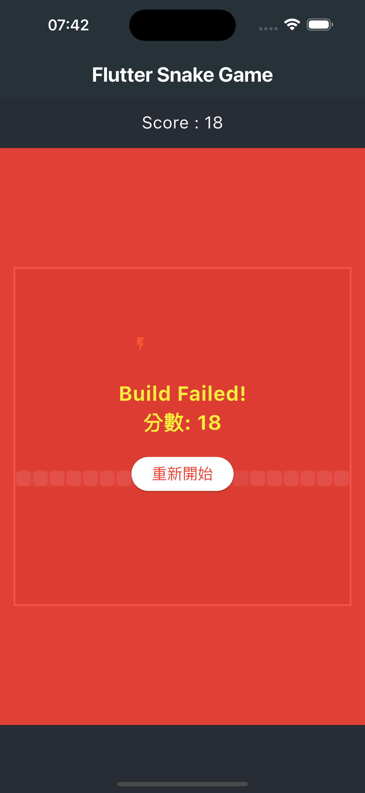

# Flutter Hot Reload Snake 🐍⚡️

[](https://flutter.dev)
[](https://dart.dev)

這是一個使用 Flutter 框架開發的經典貪吃蛇遊戲，但加入了一些 Flutter 開發者才能體會的「梗」！

## 專案「梗」說明

不同於傳統的貪吃蛇：

*   **🐍 蛇 (Widget Tree):** 你控制的不是蛇，而是由藍色方塊組成的 Flutter **Widget Tree**！
*   **⚡️ 食物 (Hot Reload):** 目標是收集 Flutter 的 **Hot Reload (熱重載)** 圖標，而不是蘋果。
*   **📈 成長 (功能迭代):** 每吃到一個 Hot Reload，你的 Widget Tree 就會變長，象徵 App 功能增加或狀態更新。
*   **🧱 結束 (Build Failed):** 撞到牆壁或自己？你會看到熟悉的 Flutter **紅屏錯誤 (Red Screen of Death)**，並顯示 "Build Failed!"。

## 畫面截圖

<table>
  <tr>
    <td align="center">
      <b>開始畫面</b><br>
      
    </td>
    <td align="center">
      <b>遊戲進行</b><br>
      
    </td>
    <td align="center">
      <b>遊戲結束</b><br>
      
    </td>
  </tr>
</table>

## Demo 影片
[點此觀看 Demo 影片](https://streamable.com/bdwppo)

## Medium 連結
[點此觀看 Medium](https://medium.com/@bruce930110930110/創作有梗的flutter-app-遊戲-d18db849a1b3)

## 功能特色

*   經典貪吃蛇遊戲玩法
*   基於 Flutter 開發的趣味主題
*   使用方向鍵 (或螢幕按鈕) 控制蛇 (Widget Tree) 的移動
*   吃到食物 (Hot Reload) 後得分並增加長度
*   隨著得分增加，遊戲速度逐漸加快 
*   撞到自身則遊戲結束，顯示特色 Game Over 畫面
*   分數顯示 (Widgets 數量)

## 技術實現重點

這個專案應用了以下 Flutter 核心概念：

*   **`StatefulWidget`:** `GameScreen` 用於管理並更新遊戲的動態狀態 (蛇位置、食物、分數、遊戲狀態)。
*   **`setState`:** 在遊戲狀態改變時 (移動、吃食物、開始/結束) 調用，通知 Flutter 重繪 UI。
*   **`Callback Function (Lifting State Up)`:** `ControlPanel` (控制按鈕) 將用戶操作透過回調函數傳遞給父層 `GameScreen`，由 `GameScreen` 統一管理方向狀態。
*   **`Timer.periodic`:** 創建遊戲的核心循環，定時觸發蛇的移動和相關邏輯檢查。

## 專案結構
```text
lib/
├── main.dart # App 進入點
├── screens/
│ └── game_screen.dart # 主要遊戲畫面 (StatefulWidget)
├── widgets/
│ ├── game_board.dart # 遊戲棋盤 (StatelessWidget)
│ └── control_panel.dart # 控制按鈕 (StatelessWidget, 使用回調)
├── models/
│ ├── game_state.dart # 定義遊戲狀態 Enum (Playing, Paused, GameOver)
│ └── direction.dart # 定義方向 Enum (Up, Down, Left, Right)
└── constants.dart # 存放遊戲常數 (格子數量, 速度, 顏色等)
```

## 如何開始

1.  **確保已安裝 Flutter:** 如果尚未安裝，請參考 [Flutter 官方安裝指南](https://flutter.dev/docs/get-started/install)。
2.  **Clone 儲存庫:**
    ```bash
    git clone https://github.com/Wzx0110/flutter_snake_game.git
    cd flutter_snake_game
    ```
3.  **取得依賴:**
    ```bash
    flutter pub get
    ```
4.  **執行 App:**
    ```bash
    flutter run
    ```
    (選擇一個模擬器或連接的實體設備)

## 如何遊玩

*   點擊「開始遊戲」按鈕。
*   使用螢幕上的方向按鈕控制藍色 Widget Tree 的移動方向。
*   目標是吃到黃色的 ⚡️ (Hot Reload) 圖標。
*   每吃到一個 ⚡️，分數會增加，Widget Tree 會變長，速度會加快。
*   避免撞到 Widget Tree 自身。
*   祝你 Build Success！


